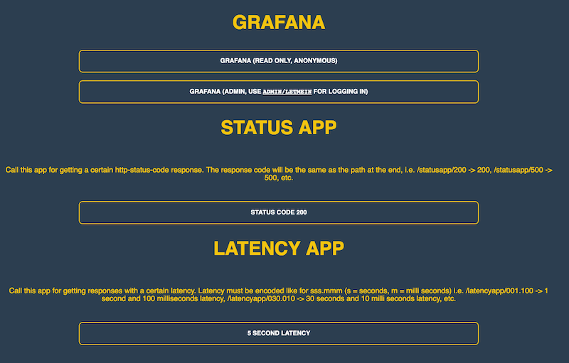

# nc server

Ultra minimal Kubernetes and Docker apps for testing stuff. They just need an alpine linux image with no additional software added.

## Docker minimal server

    # just a 200
    docker run -p 8080:80 --rm alpine sh -xc 'cd /tmp;echo -e "#!/bin/sh\necho HTTP/1.1 200 OK">s;chmod +x s;nc -lks 0.0.0.0 -p80 -e ./s'
    
    # 'verbose' response with 'OK' as body
    docker run -p 8080:80 --rm alpine sh -xc 'cd /tmp;echo -e "#!/bin/sh\necho \"HTTP/1.1 200 OK \nContent-Length: 2\n\nOK\"">s;chmod +x s;nc -lks 0.0.0.0 -p80 -e ./s'

or as Dockerfiles:

    FROM alpine
    CMD sh -xc 'cd /tmp;echo -e "#!/bin/sh\necho HTTP/1.1 200 OK">s;chmod +x s;nc -lks 0.0.0.0 -p80 -e ./s'

verbose version:

    FROM alpine
    CMD sh -xc 'cd /tmp;echo -e "#!/bin/sh\necho \"HTTP/1.1 200 OK \nContent-Length: 2\n\nOK\"">s;chmod +x s;nc -lks 0.0.0.0 -p80 -e ./s'

## toc.yaml

An app that can display a table of contents with links displayed as big buttons (see screenshot below). Set the `CONTENT` env variable in the deployment for content (see [toc.yaml](./toc.yaml))

## statusapp.yaml

An app which returns a status encoded in that path of the url

- `/300` -> returns status code 300
- `/404` -> returns status code 404
- ...

sub paths works as well, so no need to create rewrite rules when this app is mounted with a prefix path:

- `/prefix/path/500` -> returns status code 500

## latencyapp.yaml

An app which add latency to a reply. Latency must be encoded like for `sss.mmm` (s = seconds, m = milli  seconds)

- `/001.100` -> adds 1 second and 100 milliseconds latency
- `/030.010` -> adds 30 seconds and 10 milli seconds latency, etc.
- ...

sub paths works as well, so no need to create rewrite rules when this app is mounted with a prefix path:

- `/prefix/path/002.000` -> adds 2 seconds latency

  